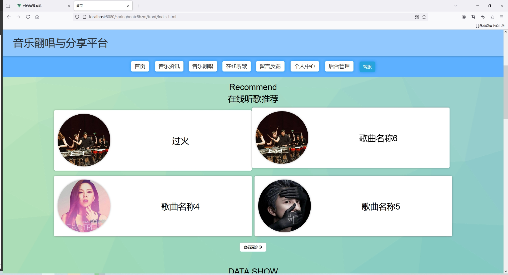
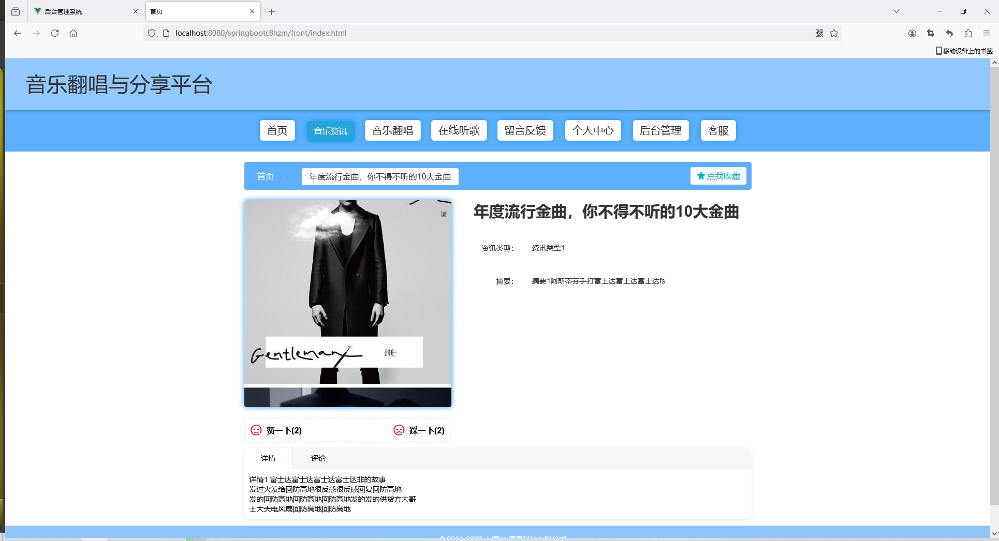
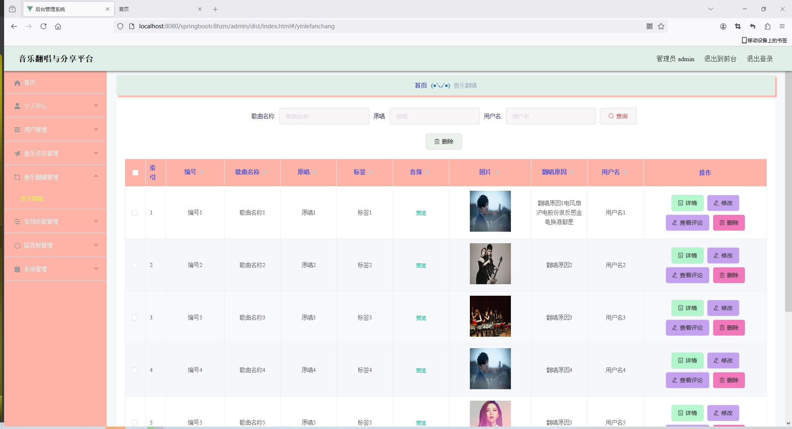
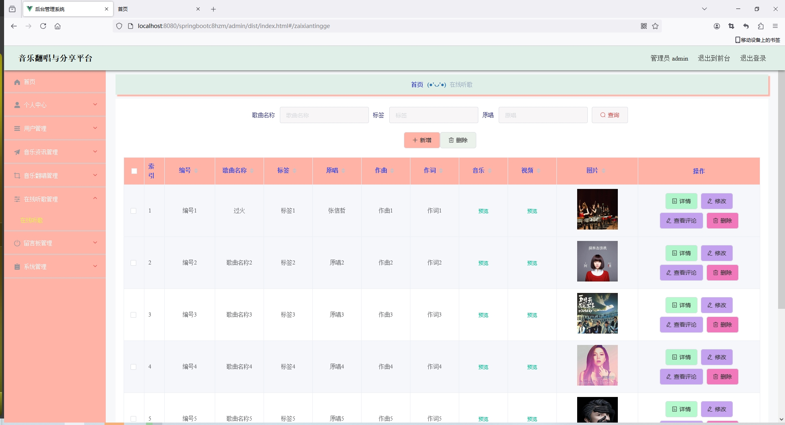
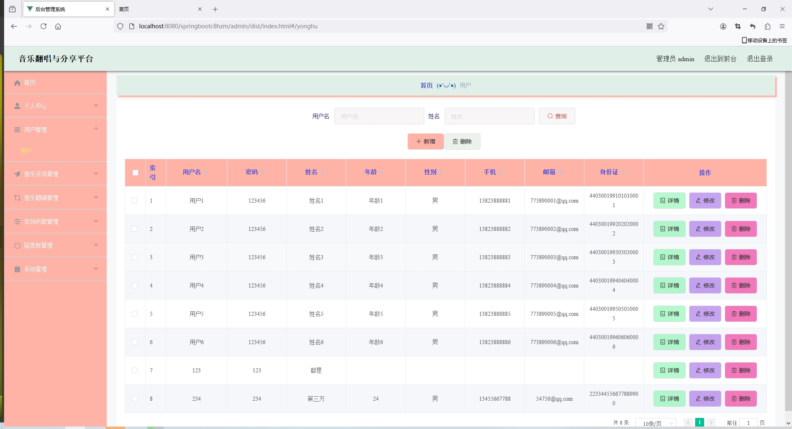
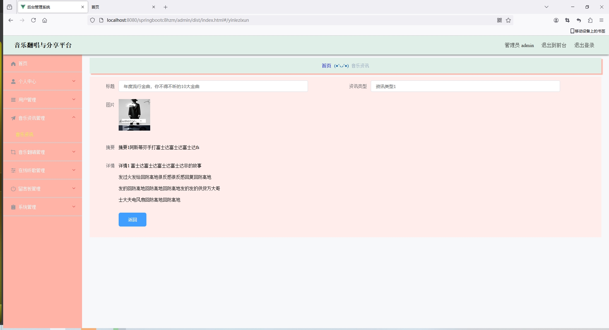

<h1 align="center">基于SpringBoot实现的音乐分享平台【带文档】</h1>

 获取sql文件 QQ: 3645296857 QQ群: 978300347 

<h4> 需要视频演示可联系上述QQ，私发视频链接 </h4>

 获取更多高质量源码，请访问：[mzoo源码网](https://mzoocodes.com/)

## 简介

> 本代码来源于网络,仅供学习参考使用!
>
> <b style="color: dodgerblue"> 提供1.远程部署/2.修改代码/3.定制程序/4.文档指导/5.框架代码讲解、技术解答、代码讲解等服务 </b>
>
> 前台地址：http://localhost:8080/springbootc8hzm/front/index.html
> 
> 后台地址：http://localhost:8080/springbootc8hzm/admin/dist/index.html
>
> 管理员: admin 密码: admin
> 
> 用户：用户1 密码：123456
>

## 项目介绍

基于SpringBoot实现的音乐分享平台【带文档】：前端 vue、axios、elementui，后端 springboot、mybatis，系统角色分为：管理员和用户，管理员在管理后台对用户信息、在线听歌、音乐资讯管理等；用户可以查看歌曲听歌、收藏等。主要功能如下：

### 管理员

- 基本操作: 登录、修改个人信息、修改密码、获取个人信息、客服聊天
- 用户管理: 获取用户信息列表、查看用户信息详情、添加用户信息、修改用户信息、删除用户信息、筛选用户信息
- 音乐资讯管理: 获取音乐资讯信息列表、查看音乐资讯信息详情、添加音乐资讯信息、修改音乐资讯信息、删除音乐资讯信息、筛选音乐资讯信息、查看资讯评论、回复评论、删除评论、获取评论列表、筛选评论信息
- 音乐翻唱管理: 获取音乐翻唱信息列表、查看音乐翻唱信息详情、添加音乐翻唱信息、修改音乐翻唱信息、删除音乐翻唱信息、筛选音乐翻唱信息、查看翻唱评论、回复评论、删除评论、获取评论列表、筛选评论信息
- 在线听歌管理: 获取在线听歌信息列表、查看在线听歌信息详情、添加在线听歌信息、修改在线听歌信息、删除在线听歌信息、筛选在线听歌信息、查看在线听歌评论、回复评论、删除评论、获取评论列表、筛选评论信息
- 留言板管理: 获取留言板信息列表、删除留言板信息、修改留言板信息、查看留言板信息详情、筛选留言板信息
- 轮播图管理: 获取轮播图信息列表、删除轮播图信息、修改轮播图信息、查看轮播图信息详情、筛选轮播图信息、添加轮播图信息

### 用户

- 基本操作: 登录、注册、修改个人信息、修改密码、获取个人信息、客服聊天
- 在线听歌模块: 获取在线听歌列表、查看在线听歌详情、评论、点赞、拉踩、听歌、收藏
- 音乐资讯模块: 获取音乐资讯列表、查看音乐资讯详情、评论、点赞、拉踩、收藏
- 音乐翻唱模块: 获取音乐翻唱列表、查看音乐翻唱详情、评论、点赞、拉踩、收藏、听歌
- 在线听歌模块: 获取在线听歌列表、查看在线听歌详情、评论、点赞、拉踩、收藏、听歌
- 留言模块: 获取留言列表、留言

## 环境

- <b>IntelliJ IDEA 2020.3</b>

- <b>Mysql 5.7.26</b>

- <b>Maven 3.6.3</b>

- <b>JDK 1.8</b>

## 运行截图

